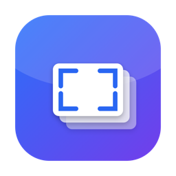

<h1 align="center">utils_mac</h1>

<p align="center">
  <strong>A growing collection of utilities for macOS.</strong><br>
  Small, focused tools for everyday work on your Mac.
</p>

<p align="center">
  
  <a href="LICENSE"></a>
  <a href="https://github.com/Alt43-uno/utils_mac/actions/workflows/build.yml"></a>
</p>

<p align="center">
  <a href="#utilities">Explore utilities</a>
  &nbsp; · &nbsp;
  <a href="https://github.com/Alt43-uno/utils_mac/releases">Downloads</a>
  &nbsp; · &nbsp;
  <a href="CONTRIBUTING.md">Contributing</a>
  &nbsp; · &nbsp;
  <a href="CHANGELOG.md">Changelog</a>
</p>

---

**utils_mac is a home for multiple macOS utilities.** Each tool lives in its own
directory, with documentation for its features, setup, and requirements.

Screenshot Booster is the first available application. More utilities will be
developed and published here over time, with documentation and downloadable
releases as they become available.

## Utilities

| Utility | What it does | Requirements | Get started |
| :--- | :--- | :--- | :--- |
| **[Screenshot Booster](screenshot_booster/README.md)** | Capture screenshots, keep them pinned, annotate, and share. | macOS 26+ · Apple Silicon or Intel | [Download v1.0.2](https://github.com/Alt43-uno/utils_mac/releases/download/v1.0.2/ScreenshotBooster-1.0.2-universal.dmg) |

Requirements and installation steps are specific to each utility. Check its
documentation before downloading or building.

## Screenshot Booster



**Capture → annotate → drag into your workflow.**

A native screenshot app built with Swift, AppKit, and SwiftUI. Every capture
stays pinned as a floating thumbnail until you dismiss it, ready to edit, copy,
save, or drag into another application.

- **Capture your way.** Grab an area, a window, or the screen under the pointer.
- **Keep screenshots handy.** Manage a stack of thumbnails in your chosen screen corner.
- **Add clear annotations.** Use arrows, shapes, text, freehand drawing, highlighting, blur, and pixelation.
- **Keep edits flexible.** Move and resize annotations, undo changes, zoom, and crop while preserving the original.
- **Export when ready.** Copy to the clipboard, drag into another app, or save as PNG or JPEG.

The interface uses Liquid Glass and supports multiple displays with different
backing scales. Screenshots and edits are stored locally; the app does not
upload them to a server.

### Install

1. [Download the universal DMG](https://github.com/Alt43-uno/utils_mac/releases/download/v1.0.2/ScreenshotBooster-1.0.2-universal.dmg).
2. Open it and drag **Screenshot Booster** into **Applications**.
3. Launch the app and find its camera icon in the menu bar.
4. Grant **Screen Recording** permission when you first capture. Restart the app if macOS requests it.

**Requires macOS 26 Tahoe or later.** The same download supports Apple Silicon
and Intel. Developer tools are only needed when building from source.

> **First launch:** the current release is signed ad-hoc and is not notarised by
> Apple. If macOS blocks opening it, follow [Apple's instructions](https://support.apple.com/102445)
> for an app you trust. Updating may require granting Screen Recording permission again.

### Quick controls

| Action | Default shortcut |
| :--- | :--- |
| Capture an area | `Control + Shift + 1` |
| Capture a window | `Control + Shift + 2` |
| Capture the screen under the pointer | `Control + Shift + 3` |
| Cancel a capture | `Esc` |

Click a thumbnail to edit it, drag it into another app to share it, or right-click
for more actions. Capture shortcuts can be changed in **Settings → Shortcuts**.

**[Full guide: tools, gestures, settings, and architecture →](screenshot_booster/README.md)**

## Build and develop

Clone the collection, then follow the instructions for the utility you want to work on:

```bash
git clone https://github.com/Alt43-uno/utils_mac.git
cd utils_mac
```

<details>
<summary><strong>Build Screenshot Booster</strong></summary>

You need macOS 26+ and Xcode or Command Line Tools with a macOS 26+ SDK.
The application has no third-party library dependencies.

```bash
cd screenshot_booster
./Scripts/build_app.sh                  # build for this Mac
./Scripts/build_app.sh --install --run  # build, replace the installed app, and launch
./Scripts/run_tests.sh                  # run the complete test suite
```

To create a universal installer:

```bash
./Scripts/build_app.sh --universal
./Scripts/make_dmg.sh --no-build
```

The app is written to `build/`; the DMG is written to `dist/`.
Tests use isolated temporary storage, separate from your screenshots.

</details>

### Repository layout

```text
utils_mac/
├── screenshot_booster/   First utility: source, documentation, scripts, and tests
├── docs/assets/          Images used in the documentation
├── .github/              Build workflow and issue templates
├── CONTRIBUTING.md       Development and contribution guide
├── CHANGELOG.md          Release history and unreleased changes
└── SECURITY.md           Security and private reporting policy
```

New utilities will get their own directories and entries in the catalog above.
The current GitHub Actions workflow checks repository privacy, builds and tests
Screenshot Booster, and uploads its DMG as a build artifact. It runs on
GitHub-hosted macOS machines.

## Ideas, feedback, and contributions

Have an idea for another Mac utility, or found a problem with an existing one?
[Open an issue](https://github.com/Alt43-uno/utils_mac/issues/new/choose) and
describe the workflow you want to improve.

See [CONTRIBUTING.md](CONTRIBUTING.md) before submitting a change. Report
vulnerabilities privately using the guidance in [SECURITY.md](SECURITY.md).

## License

[MIT](LICENSE).
