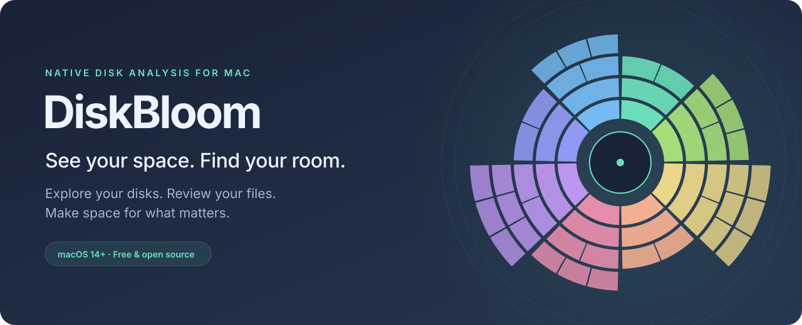
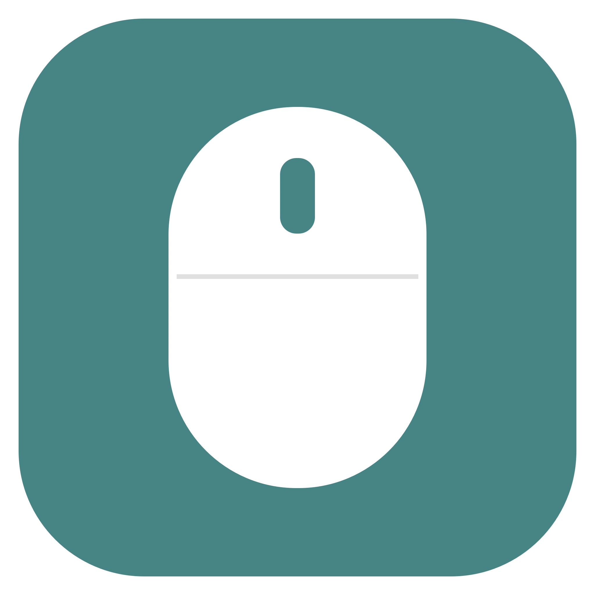
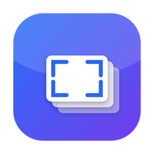

<p align="center">
  
</p>

<h1 align="center">DiskBloom</h1>

<p align="center">
  <strong>A clear view of your disks. A considered way to make space.</strong><br>
  Native macOS disk analysis with an interactive radial map, file previews, and a cleanup collection.
</p>

<p align="center">
  <a href="diskbloom/README.md"></a>
  <a href="diskbloom/Package.swift"></a>
  <a href="LICENSE"></a>
  <a href="diskbloom/docs/FEATURE_PARITY.md"></a>
</p>

<p align="center">
  <a href="https://github.com/Alt43-uno/utils_mac/releases/tag/diskbloom-v0.1.0">Download preview</a> ·
  <a href="#get-started">Get started</a> ·
  <a href="diskbloom/README.md">Руководство · RU</a> ·
  <a href="diskbloom/docs/FEATURE_PARITY.md">Feature status</a> ·
  <a href="CONTRIBUTING.md">Contribute</a> ·
  <a href="https://github.com/Alt43-uno/utils_mac/issues/new/choose">Feedback</a>
</p>

**DiskBloom** helps you understand what takes up space on your Mac and choose what
can go. Explore local disks, external drives, mounted network volumes, and cloud
accounts in a native SwiftUI and AppKit interface. Follow the radial map into a
folder, preview a file, then collect the items you want to review before removal.

Inspired by DaisyDisk's disk-analysis workflow, DiskBloom has its own code and
artwork. It is an independent project and is not affiliated with DaisyDisk.
This repository also contains [MouseCraft and Screenshot Booster](#applications).

## Explore. Review. Make room.

| Explore your space | Understand your files | Review before cleanup |
| :--- | :--- | :--- |
| Interactive sunburst map with hover details, folder navigation, and history. | Quick Look, Finder reveal, large-file lists, search, and file metadata. | Drag files into a collection, remove items from your selection, and confirm the final list. |
| Multiple scans with progress and cancellation; metadata-only local scanning. | Allocated and logical sizes, hard links, sparse files, restricted folders, and cloud placeholders. | Trash by default for local files, a cancellable countdown, and checks for changes before removal. |

- **Local and cloud:** Dropbox, Google Drive, OneDrive, and Box through an optional bundled rclone helper; multiple accounts and metadata scanning.
- **Native Mac tools:** APFS snapshot inspection, a read-only administrator scanning worker, keyboard navigation, and Russian / English UI.
- **Your reports:** export CSV or JSON to a location you choose. No analytics or automatic report uploads.

## Get started

**[Download DiskBloom 0.1.0 Preview for Apple Silicon](https://github.com/Alt43-uno/utils_mac/releases/download/diskbloom-v0.1.0/DiskBloom-0.1.0-arm64.dmg)** ·
[ZIP](https://github.com/Alt43-uno/utils_mac/releases/download/diskbloom-v0.1.0/DiskBloom-0.1.0-arm64.zip) ·
[SHA-256](https://github.com/Alt43-uno/utils_mac/releases/download/diskbloom-v0.1.0/DiskBloom-0.1.0-arm64.sha256)

Open the DMG and drag DiskBloom into Applications. This preview is signed ad hoc
and is not notarized; macOS may block its first launch. Follow
[Apple's guidance for opening an app you trust](https://support.apple.com/102445).
An Intel binary is not included in this release.

To build from source, use macOS 14+ and Swift 6.2+ with Xcode or Command Line Tools:

```sh
git clone https://github.com/Alt43-uno/utils_mac.git
cd utils_mac/diskbloom
./Scripts/build_app.sh --cloud
open build/DiskBloom.app
```

The build creates **`build/DiskBloom.app`** and **`build/DiskBloom.zip`**.
`--cloud` downloads the pinned rclone helper from its official server and checks
its SHA-256; omit it for a local-only bundle. No global installation is needed.
To explore the interface with sample data:

```sh
open -n build/DiskBloom.app --args --demo
```

Demo mode cannot delete files. For real use, select a disk or folder, scan it,
explore the map, and review unwanted files in the collection. Full Disk Access
is granted manually in System Settings when needed.

**Development status:** the main workflows are implemented, with 36 automated
tests and local UI checks. Full DaisyDisk parity is not established. APFS clone
block deduplication and individual snapshot size estimates remain incomplete;
live cloud OAuth and administrator authorization need further verification.
The current build is ad hoc signed, without Developer ID notarization, and is
built for the host architecture; verification so far is on Apple Silicon.
See the [complete feature-status table](diskbloom/docs/FEATURE_PARITY.md).

**[Usage & shortcuts →](diskbloom/README.md)** ·
**[Architecture →](diskbloom/docs/ARCHITECTURE.md)** ·
**[Privacy & permissions →](SECURITY.md#diskbloom)**

## Applications

The projects share this repository, with separate source trees, requirements,
versions, and build scripts. Existing releases for the other apps remain available.

| Application | What it does | Requirements | Availability |
| :--- | :--- | :--- | :--- |
| **[DiskBloom](diskbloom/README.md)** | Visual disk analysis, file previews, and reviewed cleanup for local and cloud storage. | macOS 14+ | [0.1.0 Preview · arm64 DMG](https://github.com/Alt43-uno/utils_mac/releases/download/diskbloom-v0.1.0/DiskBloom-0.1.0-arm64.dmg) |
| **[MouseCraft](mousecraft/README.md)** | Smooth wheel scrolling, button gestures, and per-app profiles. | macOS 13+ | [0.2.1 · universal DMG](https://github.com/Alt43-uno/utils_mac/releases/download/mousecraft-v0.2.1/MouseCraft-0.2.1-universal.dmg) · [PKG](https://github.com/Alt43-uno/utils_mac/releases/download/mousecraft-v0.2.1/MouseCraft-0.2.1-universal.pkg) |
| **[Screenshot Booster](screenshot_booster/README.md)** | Capture, annotate, pin, and recognize text and QR codes. | macOS 26+ | [1.1.0 · universal DMG](https://github.com/Alt43-uno/utils_mac/releases/download/v1.1.0/ScreenshotBooster-1.1.0-universal.dmg) |

## MouseCraft



**Make your wheel mouse feel at home on macOS.**

MouseCraft is a **free, open-source Mac Mouse Fix alternative** for standard
wheel mice on macOS 13 or later. It combines smooth scrolling, mouse button
remapping, mouse gestures, and per-app profiles in a native settings window with
a menu bar control. No trial, subscription, account, telemetry, or license checks.
This is an early release; see the compatibility limits below before choosing it
as your mouse utility.

- **Smooth scrolling:** choose the feel, speed, direction, and slow-wheel precision.
- **Wheel modifiers:** Shift for horizontal scrolling, Command for zoom, Control
  for faster movement, and Option for precision; each modifier is configurable.
- **Buttons and gestures:** clicks, holds, drags, and scrolling while holding a
  button. Presets for three- and five-button mice, custom shortcuts, and app actions.
- **Independent switches:** turn off button gestures while keeping smooth scrolling.
  Middle-button presses, drags, and releases then reach web canvases unchanged.
- **App profiles:** inherit settings, change scrolling and assignments, or bypass
  processing for a specific application.
- **Native settings:** grouped controls, keyboard navigation with ⌘1–⌘5, launch
  at login, connection diagnostics, and JSON import/export.

### Install MouseCraft

1. [Download the universal DMG](https://github.com/Alt43-uno/utils_mac/releases/download/mousecraft-v0.2.1/MouseCraft-0.2.1-universal.dmg), open it, and drag **MouseCraft** into **Applications**.
   Alternatively, use the [PKG installer](https://github.com/Alt43-uno/utils_mac/releases/download/mousecraft-v0.2.1/MouseCraft-0.2.1-universal.pkg).
2. Eject the disk and launch the copy in Applications. Quit any previous copy
   before updating; your settings are retained.
3. Open **Overview** and grant **Accessibility**
   and **Input Monitoring** in System Settings.
4. Enable MouseCraft. The status must say **Processing is active**.
5. Adjust scrolling. For middle-button panning on a website, turn off
   **Buttons & Gestures → Enable Buttons & Gestures**.

The interface and installer instructions are in English. The menu bar provides pause, settings,
and quit commands; closing the settings window keeps processing active.

**0.2.1 is an early release.** Trackpads, Magic Mouse, and high-resolution wheels
that report continuous input pass through unchanged. Native pinch, Smart Zoom,
and swipes are experimental; interactive Spaces gestures and per-device profiles
are not implemented. See [compatibility and feature status](mousecraft/FEATURE_PARITY.md).

The release is signed ad hoc, without Developer ID notarization. macOS may block
its first launch; follow [Apple's instructions for opening an app you trust](https://support.apple.com/102445).
An update may require re-enabling permissions. No script grants permissions or
removes Gatekeeper protections automatically.

**[Full guide in Russian →](mousecraft/README.md)** ·
**[Release notes →](https://github.com/Alt43-uno/utils_mac/releases/tag/mousecraft-v0.2.1)** ·
**[SHA-256 checksums →](https://github.com/Alt43-uno/utils_mac/releases/download/mousecraft-v0.2.1/MouseCraft-0.2.1-universal.sha256)**

## Screenshot Booster



**Capture → annotate → drag into your workflow.**

Capture an area, a window, or a screen and keep it as a floating thumbnail.
Annotate with arrows, shapes, text, highlighting, blur, and pixelation; zoom,
crop, undo, and export as PNG or JPEG. Recognize English and Russian text and
QR codes together using Apple Vision, entirely on your Mac.

Install the [universal DMG](https://github.com/Alt43-uno/utils_mac/releases/download/v1.1.0/ScreenshotBooster-1.1.0-universal.dmg)
in Applications and grant Screen Recording when first capturing.
**Requires macOS 26 Tahoe or later.** This release is also signed ad hoc and is
not notarized.

| Action | Default shortcut |
| :--- | :--- |
| Capture an area | Control + Shift + 1 |
| Capture a window | Control + Shift + 2 |
| Capture the screen under the pointer | Control + Shift + 3 |
| Select an area and recognize text and QR codes | Control + Shift + 4 |

**[Full Screenshot Booster guide →](screenshot_booster/README.md)**

## Build and develop

Install Xcode or Command Line Tools, then clone the repository:

```sh
git clone https://github.com/Alt43-uno/utils_mac.git
cd utils_mac
```

For DiskBloom (Swift 6.2+, macOS 14+):

```sh
cd diskbloom
./Scripts/build_app.sh --cloud
./Scripts/test.sh
```

For MouseCraft (Swift 6.0+; tests require macOS 14+):

```sh
cd mousecraft
./Scripts/run_tests.sh
./Scripts/build_app.sh --universal
./Scripts/make_installer.sh --no-build
```

For Screenshot Booster (macOS 26+ SDK):

```sh
cd screenshot_booster
./Scripts/run_tests.sh
./Scripts/build_app.sh --universal
./Scripts/make_dmg.sh --no-build
```

Builds go to each application's `build/`; installers go to `dist/`.
The applications use native system frameworks. DiskBloom optionally bundles rclone
for cloud connections; its license is included in the app bundle.
Read [CONTRIBUTING.md](CONTRIBUTING.md) for verification and release instructions.

```text
utils_mac/
├── diskbloom/            DiskBloom source, tests, app packaging, and full guide
├── mousecraft/           MouseCraft source, tests, installers, and full guide
├── screenshot_booster/   Screenshot Booster source, tests, and full guide
├── docs/assets/          Public app artwork
├── .github/              Per-app CI and issue templates
├── CHANGELOG.md          Per-application release history
├── CONTRIBUTING.md       Development and release guide
└── SECURITY.md           Permissions, privacy, and vulnerability reporting
```

## Feedback and contributions

[Open an issue](https://github.com/Alt43-uno/utils_mac/issues/new/choose) and
include the application name, version, macOS version, and steps to reproduce.
For MouseCraft, include your mouse model and the connection status.
Report vulnerabilities privately as described in [SECURITY.md](SECURITY.md).

## License

Original application code and artwork are available under the [MIT license](LICENSE).
Cloud-enabled DiskBloom builds include rclone; see its
[third-party notices](diskbloom/Resources/ThirdPartyNotices.txt).
